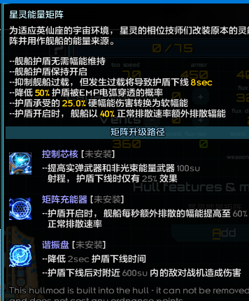
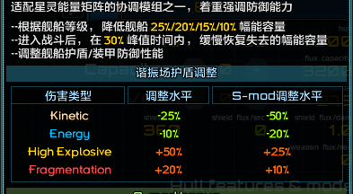

# 舰船插件 精确聚焦

## 舰船插件的额外描述部分
带图文的舰船插件额外描述：
```java {10,11,13,23,24,33,34,35,48,49,57-78}
    //在你的舰船插件代码中添加以下代码
    @Override
    public void addPostDescriptionSection(TooltipMakerAPI tooltip, ShipAPI.HullSize hullSize, ShipAPI ship, float width, boolean isForModSpec) {
        float pad = 5f;//控制间距5个像素
        Color h = Misc.getHighlightColor();//获取高亮的颜色
        //addSectionHeading三个参数分别为标题，布局方式（左中右等等），上下边距
        tooltip.addSectionHeading("额外描述", Alignment.TMID, pad * 2f);
        //添加一张图片在列头
        TooltipMakerAPI text = tooltip.beginImageWithText("已注册的图片路劲", 32f/*图片大小*/);
        //text.addPara添加一行文字说明，%s为高亮占位符
        text.addPara("%s", pad, new Color(155, 155, 255, 255), "高亮部分文字");
        text.addPara("%s", pad, h, "高亮部分文字");
        //最后将text添加到tooltip
        tooltip.addImageWithText(pad);
    }
```
参考图片



使用这种写法可以更直观的展示该船插与其他船插/武器/舰船系统等等的联动关系

带表格的舰船插件额外描述：
```java {10,11,13,23,24,33,34,35,48,49,57-78}
    //在你的舰船插件代码中添加以下代码
    @Override
    public void addPostDescriptionSection(TooltipMakerAPI tooltip, ShipAPI.HullSize hullSize, ShipAPI ship, float width, boolean isForModSpec) {
        float pad = 5f;//控制间距5个像素
        float tableWidth = width - pad;//表格宽度
        tooltip.addSectionHeading("额外描述", Alignment.TMID, pad * 2f);
        tooltip.beginTable(
                Misc.getBasePlayerColor(),
                Misc.getDarkPlayerColor(),
                Misc.getBrightPlayerColor(),
                20f,
                //从这往下可以按照格式添加列
                "第一列", tableWidth * 0.35f,
                "第二列", tableWidth * 0.25f,
                "第三列", tableWidth * 0.4f);
        //添加一行数据，颜色后面的参数数量需要与表格列数一至
        tooltip.addRow(new Color(255, 211, 154), DamageType.KINETIC.getDisplayName(),
                 "%",
                 "%");
        //添加表格到额外说明
        tooltip.addTable("N/A", 0, pad);
    }
```
参考图片



使用这种写法可以更好展示针对不同的伤害类型提供不同加成的效果